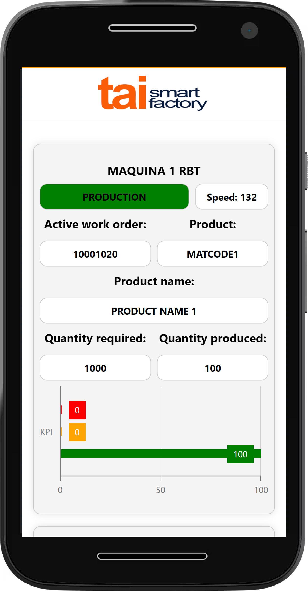
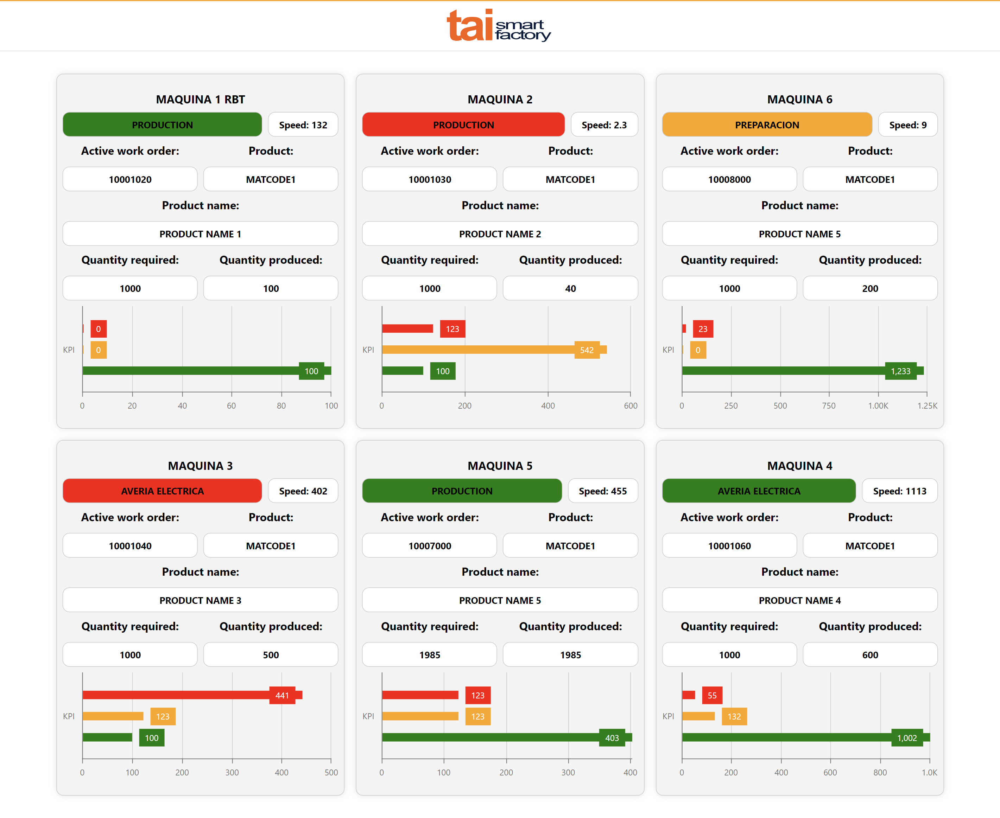

# 📑 App

> Web application represent the returned data by simulating a factory machine monitor.

▶️ Link the project: https://prueba-tai-smart-factory.netlify.app/

</br>

# 🎨Screenshots

<div align="center" >

 
  &nbsp  &nbsp &nbsp  &nbsp
 
</div>

<br/>

# 💫Getting Started

**Clone the repo**

```sh
git clone https://github.com/CristinaFores/prueba-tai-smart-factory
```

**Install NPM packages**

```sh
npm install
```

**Run the project**

```sh
npm start
```

- Then, open [http://localhost:3000](http://localhost:3000)

<br/>

# 💻 Stack

- [React.js](https://nextjs.org/)
- [TypeScript](typescriptlang.org)
- [Styled-Components](https://styled-components.com/)
- [Jest](https://jestjs.io/)
- [Testing-Library](https://testing-library.com/)
